# Affymetrix(r) Mismatch (MM) Probes: Useful After All

Robert M Flight, Abdallah M Eteleeb, Eric C Rouchka

## ABSTRACT

Affymetrix(r) GeneChip(r) microarray design define probe sets consisting of 11, 16, or 20 distinct 25 base pair (BP) probes
for determining mRNA expression for a specific gene, which may be covered by one or more probe sets.  Each probe has a
corresponding perfect match (PM) and mismatch (MM) set.  Traditional analytical techniques have either used the MM probes
to determine the level of cross-hybridization or reliability of the PM probe, or have been completely ignored.  Given the
availability of reference genome sequences, we have reanalyzed the mapping of both PM and MM probes to reference genomes
in transcript regions.  Our results suggest that depending of the species of interest, 66%-93% of the PM probes can be 
used reliably in terms of single unique matches to the genome, while a small number of the MM probes (typically less 
than 1%) could be incorporated into the analysis.  In addition, we have examined the mapping of PM and MM probes to five
different human genome projects, resulting in approximately a 70% overlap of uniquely mapping PM probes, and a subset of
51 uniquely mapping MM probes commonly found in all five projects, 24 of which are found within annotated exonic regions. 
These results suggest that individual variation in transcriptome regions provides an additional complexity to microarray
data analysis. Given these results, we conclude that the development of custom chip definition files (CDFs) should
include MM probe sequences to provide the most effective means of transcriptome analysis of Affymetrix(r) GeneChip(r) 
arrays.

**Categories and Subject Descriptors**: J.3 [Life and Medical Sciences]: Biology and Genetics

**General Terms**: Algorithms, Measurement, Theory

**Keywords**: Bioinformatics, microarray, probe set, custom definition files.

## INTRODUCTION

Oligonucleotide-based microarray technologies provide a methodology whereby a researcher can indirectly measure the
expression level of an mRNA molecule being actively transcribed under a set of conditions by labeling a cDNA fragment
that hybridizes to a complementary probe sequence specific to a particular transcript.  Since their first use on
customized cDNA arrays [1] in the mid-1990s, they have been used as the de-facto standard for measuring global 
transcriptional changes under differing conditions.  While RNA-Seq [2] may eventually supplant microarrays as the 
method of choice, a large number of microarray experiments exist that have been deposited into publicly available
repositories such as NCBI’s Gene Expression Omnibus (GEO) [3] and EBI’s ArrayExpress [4].  As a case in point, GEO
contains 32,471 series as of 9/6/2012.  The majority of the entries in GEO were performed on arrays designed by
companies such as Affymetrix(r), Inc. (Santa Clara, CA), Agilent Technologies, Inc. (Santa Clara, CA), Illumina(r), Inc.
(San Diego, CA), and GE Healthcare Lifesciences (Piscataway, NJ), with nearly half of the series (16,181) being
performed on various Affymetrix® arrays. 

The design of Affymetrix® GeneChip(r) arrays in particular provides for probe sets consisting of 11, 16, or 20 distinct
25 base pair (BP) probes, with each probe having a corresponding perfect match (PM) and mismatch (MM) probe.  The PM
and MM differ by the exchange of the complementary base at the 13th position in the probe.  While MM probes were
originally designed to account for signal in the PM resulting from non-specific cross-hybridization, they are often
underutilized or completely ignored. Mismatch probes have been explored for use in long oligonucleotide arrays as well
[5], but their utilization is limited to the Affymetrix(r) platform. 

Affymetrix® provides a default GeneChip® analysis package known as the Micro Array Suite 5.0 (MAS 5.0) [6] that measures the signal intensity for a particular probe pair as: 

signal = TukeyBiweight{log(PMj - MM*j)} (1)

Where MM`*` is a modified version of MM that is never bigger than the intensity value of the PM.  The motivation behind
the modified mismatch intensity MM* is to report all probe-level intensities as positive values, and to remove the
influence of the minority of probes where the MM intensity value is significantly higher than the corresponding PM
intensity.  In addition to the intensity signal, MAS 5.0 also produces a detection p-value which flags a transcript as
"P"" (present), "M"" (marginal), or "A"" (absent) based on the reliability of the probe set based on differences between
PM and MM intensities.

Known issues in the use of PM and MM probe intensities to generate a single probe set intensity values led to the
development of other approaches, including RMA [7] and GCRMA [8]  which completely ignore the MM probes. 

With the availability of individual probe and reference genome sequences, it is possible to re-map probes based on new
sources of genome annotations. This allows custom Chip Description Files (CDFs) wherein probes are grouped into novel
probe sets based on exon, transcript, and gene level annotation [9-22]. Most notable is the effort of the BrainArray
group [10] which updates custom CDFs for a large number of Affymetrix(r) GeneChips(r) by creating probe sets based on
annotated features such as Entrez Gene [23], Ensembl transcript, Ensembl gene, and RefSeq Gene [24].  Using custom CDFs
has been shown to impact the reliability of expression analysis [10, 20-22, 25]. However, to the authors’ knowledge,
only the PM probe sequences are used when generating custom CDFs.

Based on the observation that a small, yet significant number of PM-MM probe pairs exist where the MM intensity is
significantly increased over the PM intensity, our initial inclination was that these differences in intensities were
not due to cross-hybridization or rogue probes alone.  Therefore, keeping in mind that Affymetrix(r) probes have been
designed according to continually evolving genome assemblies, we proceeded to analyze PM and MM probes across eight
commonly studied species ([Table 1](#t.genomeAssemblies)) by looking at PM and MM probes that uniquely map to the respective genome.

In addition to changing functional annotations, one potential problem area for microarray probe design is the presence
of single nucleotide polymorphisms (SNPs) within a population.  As the probes are designed using a reference genome or
transcriptome, a “one-size fits all” approach has been taken for the probes on a particular array.  However, SNPs are
known to occur relatively frequently throughout the genome, with build 137 of dbSNP [26] containing over 53.5 million
reference SNPs for the human genome. We have previously studied the effects of SNPs on Affymetrix(r) GeneChips(r) [27]
showing that a large number of SNPs lie in the areas where microarray probes have been designed.  This has been taken
into account in the BrainArray’s custom CDF files which incorporate SNP information.  To study the effects that
individual variation can play in microarray analysis, we looked at the mappings of PM and MM probes within five
distinct publicly available assemblies of human genomes.

## METHODS

### Mapping of PM and MM Probes

Chromosomal-based genome assemblies were downloaded from the UCSC Goldenpath Genomes ftp server using an anonymous
login (ftp://hgdownload.cse.ucsc.edu/goldenPath/) [28] for eight commonly studied species, including *C. elegans*
(roundworm), *D. melanogaster* (fruit fly), *S. cerevisiae* (baker’s yeast), *X. tropicalis* (western clawed frog), *D. rerio*
(zebrafish), *M. musculus* (house mouse), *R. norvegicus* (brown Norway rat), and *H. sapiens* (human) ([Table 1](#t.genomeAssemblies)).  Genome
indices were created using `bowtie-build` version 0.12.8 [29] with the default parameters.  Perfect match (PM) probe
sequences for Affymetrix(r) GeneChips(r) were obtained from Bioconductor (v 2.10) probe packages, which are constructed
from data available in NetAffx ([Table 2](#t.affyGenechips)) with each new Bioconductor release. Mismatch (MM) probe sequences were
constructed by replacing the 13th base in the supplied PM probe sequence with the complementary base. PM and MM probes
were aligned to the indexed genomes using `bowtie` version 0.12.8 [29] with the parameters –v 0 and –a which used
together will report all valid probes matching with 100% identity.

**Table 1. Genome assemblies used**

Organism | Reference Assembly | Build Date
---------|--------------------|-----------
*Caenorhabditis elegans* | ce6 | May 2008
*Drosophila melanogaster* | dm3 | Apr. 2006
*Saccaromyces cerevisiae* | sc3 | Apr. 2011
*Xenopus tropicalis* | xt3 | Nov. 2009
*Danio rerio* | dr6 | Dec. 2008
*Mus musculus* | mm10 | Dec. 2011
*Rattus norvegicus* | rn4 | Nov. 2004
*Homo sapiens* | hg19 | Feb. 2009

**Table 2. Affymetrix(r) GeneChips(r) used**

Organism | GeneChip(r) Name
---------|-----------------
*Caenorhabditis elegans* | *C. elegans* Genome
*Drosophila melanogaster* | *Drosophila* Genome 2.0
*Saccaromyces cerevisiae* | Yeast Genome 2.0
*Xenopus tropicalis* | *Xenopus tropicalis* Genome
*Danio rerio* | Zebrafish Genome
*Mus musculus* | Mouse Genome 430 2.0
*Rattus norvegicus* | Rat Genome 230 2.0
*Homo sapiens* | Human Genome U133 Plus 2.0

###	Generation of Exons and Overlap

Exon regions were obtained from the UCSC genome browser as `BED` files with an entry for each exon. `mergeBed` from the
`bedTools` suite was used to merge overlapping exons from multiple transcripts into single contiguous exons. These
merged exons were used when defining overlaps of probe alignments with an exon. Probe and exon overlaps were defined
as any type of overlap with at least 23 bases overlapping on the same strand. Overlaps were determined using `Genomic Ranges` version 1.8.7 [31].

###	DNA Microarray Data

For each GeneChip(r), CEL files were downloaded from GEO for 20 random samples (with the exception of *S. cerevisiae* (12)
and *X. tropicalis* (4), the GSMs are listed in [gsmFiles.txt](gsmFiles.txt)). Probe intensities were background
corrected using the MAS background correction method implemented in Bioconductor. Depending on the application,
intensities were log (base 2), square root transformed, or used as is. 

###	Negative PM-MM Set

A PM-MM set of probes was considered to be negative if nine (two for *S. cerevisiae* and six for *X. tropicalis*) or more
samples had a negative value for the difference in the PM-MM intensities. For examination of intensity distribution,
any PM-MM pair with a negative different greater than 1000 in one or more samples was considered and examined. 

###	Probe Correlations

For each MM probe that uniquely overlapped one merged exon (designated as a true-match MM, (TM^(mm))), the correlation
with all other MM probes in the probe set (mm) and the correlation with all other TM probes that also mapped uniquely
to the same exon (if there were three or more other probes also mapped to the exon) was calculated (tm). 

###	Human Variation

To gain an understanding of individual variation and the unique mapping of microarray probes, five whole genome
assemblies were downloaded for the human genome [32-36] ([Table 3](#t.humanAssemblies)).   Probes from the HGU133APlus2.0 Affymetrix®
GeneChip® were aligned to each of these genomes using the methods previously described for mapping PM and MM probes.

**Table 3. Whole human genome sequencing projects**

Name | Abbr. | Assembly Identifier | Bioproject | Number | Race
-----|-------|---------------------|------------|--------|-----
GRCh37 | Hg19 | 420368 | 31257 | Mixed
Hs`_`Celera`_`WGSA | Celera | 281338 | 1431 | Mixed^1
HuRefPrime | JCVI | 281188 | 19621 | Caucasian
BGIAF | BGI | 165398 | 42201 | African
HsapALLPATHS1 | HSAP1 | 238948 | 59877 | Caucasian

^(1)Celera assembly consists of one African-American, one Asian-Chinese, one Hispanic-Mexican, and two Caucasians.

## RESULTS

### Probes Matching Genomic Locations 

Given the PM probe sequences and the inferred MM sequences, individual probes were mapped to the corresponding genome
assembly as outlined in Methods.  The percentage of perfect match probes mapping to the genome ranged from a low of
80% (*X. tropicalis*) to a high of 95% (*D. melanogaster*), with the exception of *S. cerevisiae* ([Table 4](#t.probeMatches)).  It must be
noted that the lower percentage of *S. cerevisiae* matches (53%) is expected, as the Yeast Genome 2.0 GeneChip(r) contains
probes for two yeast species, *S. cerevisiae* and *S. pombe*. 

**Table 4. GeneChip(r) probes mapping to reference genomes**

Organism | Number of Probe Pairs | PM Mapped to Reference | MM Mapped to Reference | PM Unique | MM Unique
--- | --- | --- | --- | --- | ---
*Ce* | 249165 | 226856 |  143 | 213745 |   96
*Dm* | 265400 | 251602 |   89 | 245712 |   54
*Dr* | 249752 | 200608 | 1282 | 171282 |  726
*Hs* | 604258 | 562673 | 1094 | 521642 |  608
*Mm* | 496468 | 456674 |  557 | 427920 |  394
*Rn* | 342410 | 304646 |  391 | 286784 |  282
*Sc* | 120855 |  63731 |    1 |  61942 |    1
*Xt* | 648548 | 519177 | 1884 | 426237 | 1014

Affymetrix(r) probesets are given suffix definitions depending upon the uniqueness of the exemplar sequence used to
design a probe set.  A designation of `_`at indicates the probe set perfectly matches a single transcript; `_`a`_`at
probe sets only perfectly match transcripts of the same gene; `_`s`_`at perfectly match multiple transcripts for the same
gene family; and `_`x`_`at indicates the probe set is identical or highly similar to other genes.  One of the
difficulties with these designations is that it relies upon a set of annotations at a particular point in time.  

Analysis of the probes that map to the genome ([Table 4](#t.probeMatches)) indicates that 82% to 98% of the mapped probes map uniquely to
a single genomic location.  The fact that a number of probes map to multiple locations is not to be unexpected due to
the restrictions placed on probe set design.  However, it is expected that those probes mapping to multiple locations
would not be from the `_`at class of probes.  

To determine the reliability of these probes with the fluctuation of unknown transcripts, those probes that map with
100% identity to two or more locations in the genome were considered.  While these probes typically represent less
than 10% of the total number of probes for a given GeneChip®, their classification could be important in detecting
cross hybridization.  One might expect that the greatest percentage of these would be within the `_`x`_`at and
`_`s`_`at classes.  However, as [Table 5](#t.probeType) shows, the larger genomes actually contain the greatest percentage in the
`_`at and `_`a`_`at classes, with anywhere from 18% (S. cerevisiae) to 91% (R. norvegicus) of the probes matching
multiple locations belonging to the `_`at class.  In addition, a small number of MM probes map to the genome as well. 
To better understand the effects this small set of MM probes might have on gene expression, we further reduced this to
a smaller subset where the mapping was within exon regions.  For these probes, we analyzed their signal intensities
from random samples compared to the overall distribution of PM and MM intensities, and the distribution of PM and MM
intensities within the corresponding exonic sequences ([Figure 1](#f.allPlots)).  As these plots indicate, MM probes mapping within
exonic regions closely follow the expression density of PM probes mapping within exonic regions, and are significantly 
shifted from the overall expression profiles of MM probes.  These results suggest that while the number of these
probes is small, they offer significant information that should not be ignored, and furthermore, can confound analyses
where MM data is incorporated.

**Table 5. Probe set classification of probes perfectly matching multiple genomic locations.** 

Organism | _x_at | _s_at | _a_at | _at | other
--- | --- | --- | --- | --- | ---
*Ce* | 4064 (31%) | 6552 (50%) | 0 (0%) | 2495 (19%) | 0 (0%)
*Dm* | 361 (6.1%) | 2742 (47%) | 224 (3.8%) | 2563 (44%) | 0 (0%)
*Dr* | 1390 (4.7%) | 404 (1.4%) | 1203 (4.1%) | 26329 (90%) | 0 (0%)
*Hs* | 9402 (23%) | 10634 (26%) | 803 (2%) | 20192 (49%) | 0 (0%)
*Mm* | 4075 (14%) | 2920 (10%) | 4893 (17%) | 16866 (59%) | 0 (0%)
*Rn* | 440 (2.5%) | 394 (2.2%) | 805 (4.5%) | 16223 (91%) | 0 (0%)
*Sc* | 81 (4.5%) | 1137 (64%) | 0 (0%) | 571 (32%) | 0 (0%)
*Xt* | 14092 (15%) | 12154 (13%) | 34877 (38%) | 31817 (34%) | 0 (0%)

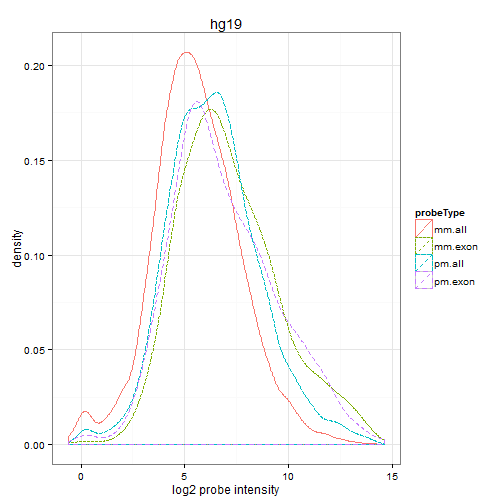  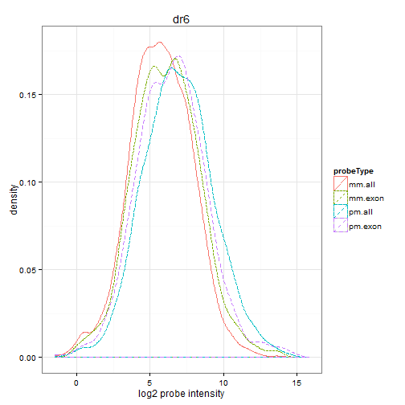 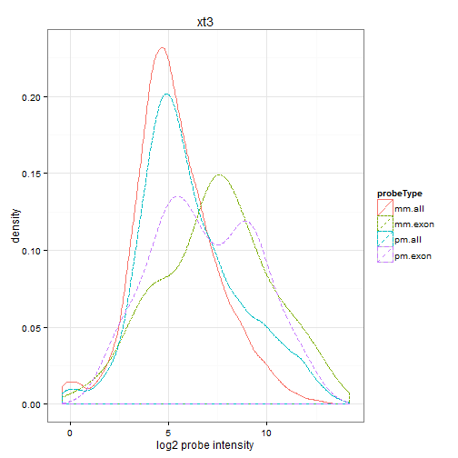  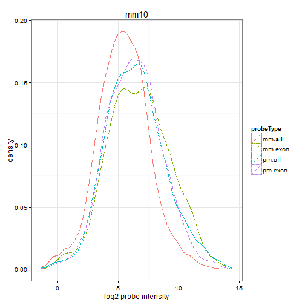 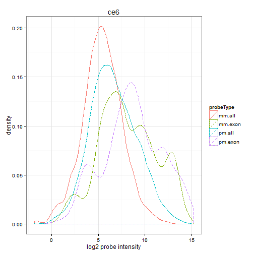 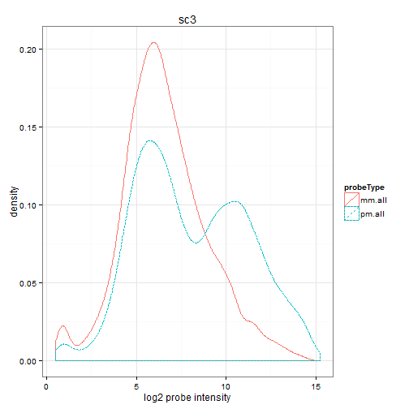 

**Figure 1. Density profile of probe intensities (log2).**  PM: perfect match, MM: mismatch.  mm.all: background MM intensities; pm.all: background PM intensities; mm.exon: intensities of MM probes in exonic regions; pm.exon: intensities of PM probes in exonic regions.

As some of these MM probes may bind to transcripts, we further considered those MM probes that uniquely mapped to
exons (irrespective of whether the corresponding PM probe mapped zero, one or multiple times to exons or the full
genome), examining the differences in signal intensity between the MM and its associated PM.  In many cases there is a
significant negative difference in the expression level of the PM-MM pair (an example is shown in Figures [ 2](#f.pmmmDensityPlot) and [ 3](#f.pmmmIntensityPlot)). 

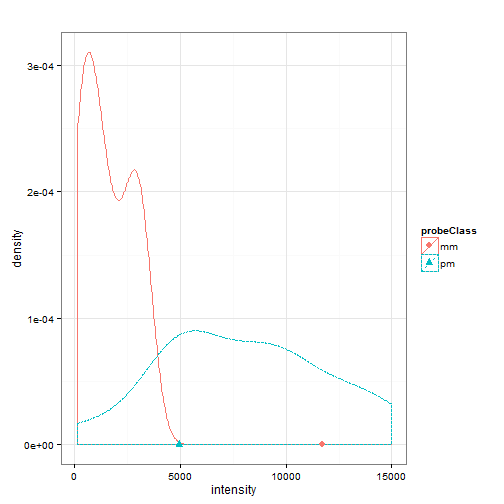 

**Figure 2. Density of MM and PM probe set intensities not including the PM-MM pair that had a large negative difference.** Intensities from zebrafish probeset Dr.5545.1.S1_at, in GEO sample
GSM604808.CEL.gz.

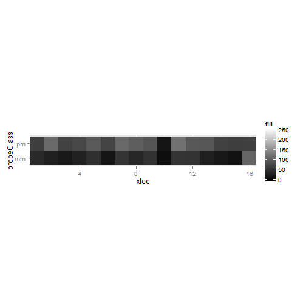 

**Figure 3. Square root transformed intensities for each PM-MM pair.** The negative difference pair is at the extreme right end of the figure. Intensities from zebrafish probeset Dr.5545.1.S1_at, in GEO sample GSM604808.CEL.gz.

If these MM probes are grouped instead with the other probes within the transcriptional region for which they uniquely
match  (we have renamed these probes as “true match” (TM) probes since they truly match the region in the genome),
there is a much better association between the probe intensities, as shown in [Figure 4](#f.tmIntensityPlot).

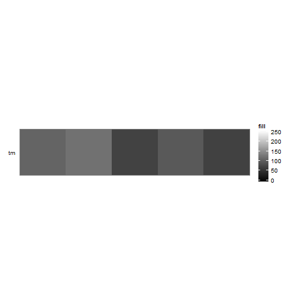 

**Figure 4. Plot of probe set intensities for zebrafish where the TM probes overlap with the same TMmm probe in [Figure 3](#f.pmmmIntensityPlot)** Intensities from zebrafish probeset Dr.5545.1.S1_at, in GEO sample GSM604808.CEL.gz.

Further analysis was performed to test the correlation of the TM probes with the expression levels of both the
annotated probe group MM probes and with the TM-mapped transcript probes ([Figure 5](#f.correlationBox)).  The box plot in [Figure 5](#f.correlationBox) clearly
indicates that the TM intensities more closely correlate with those from the group based on mapping to the same exon.

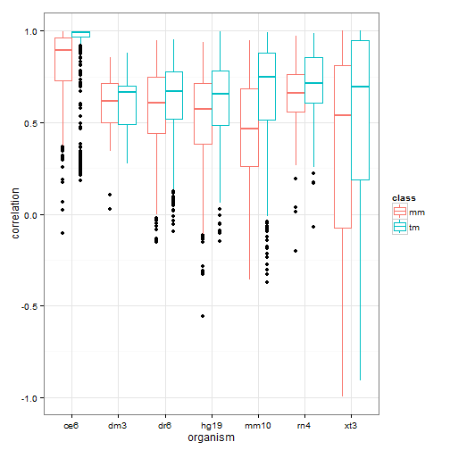 

**Figure 5. Box plot of correlations of the TMmm with MM intensities of annotated probe set (red, MM) and TM intensities of custom probe sets based on shared mapping to exons (blue, TM)**

To determine if the observed difference in the correlations from [Figure 5](#f.correlationBox) is due to measurement of different mRNA
entities, we considered the MM probe both within its annotated location as well as within the new mapped location
(TMmm). The intensity of the MM probe was compared with the intensity of its corresponding neighbor probes (MM probes
for the annotated location; PM probes for the new mapped location).  An average correlation value between intensities
was calculated on a per-exon probe basis.  The resulting correlations are summarized in [Table 6](#t.corrTable).

tm | mm | ProbeSet | Probe ID | Annotated RefSeq | Exon RefSeq | Annotated Symbol | Exon Symbol
--- | --- | --- | --- | --- | --- | --- | ---
0.8654 | 0.53475 | 209135_at | mm.209135_at.763.274 | NM_001164750, NM_001164751, NM_001164752, NM_001164753, NM_001164754, NM_001164755, NM_001164756, NM_004318, NM_020164, NM_032466, NM_032467, NM_032468 | NM_032466, NM_032468, NM_001164755, NM_001164754, NM_001164753, NM_001164752, NM_001164751 | ASPH | ASPH
0.8602 | 0.61192 | 204041_at | mm.204041_at.895.14 | NM_000898 | NM_000898 | MAOB | MAOB
0.8444 | 0.59839 | 206432_at | mm.206432_at.534.594 | NM_005328 | NM_005328 | HAS2 | HAS2
0.8080 | 0.54951 | 205004_at | mm.205004_at.1030.1044 | NM_001173487, NM_001173488, NM_017544 | NM_001173488, NM_001173487, NM_017544 | NKRF | NKRF
0.8059 | 0.78041 | 201622_at | mm.201622_at.1129.72 | NM_014390 | NM_014390 | SND1 | SND1
0.7922 | 0.81628 | 235958_at | mm.235958_at.810.810 | NM_213600, NR_033151 | NM_213600, NR_033151 | PLA2G4F | PLA2G4F
0.7890 | 0.74357 | 233052_at | mm.233052_at.882.6 | NM_001206927, NM_001371 | NM_001206927 | DNAH8 | DNAH8
0.7728 | 0.36086 | 206084_at | mm.206084_at.139.1104 | NM_001207015, NM_001207016, NM_002849, NM_130846 | NM_002849, NM_001207015, NM_130846, NM_001207016 | PTPRR | PTPRR
0.7546 | 0.39994 | 217416_x_at | mm.217416_x_at.747.452 |  | NM_152924, NM_007011 |  | ABHD2
0.7474 | 0.55101 | 203646_at | mm.203646_at.468.274 | NM_004109 | NM_004109 | FDX1 | FDX1
0.7416 | 0.60912 | 210467_x_at | mm.210467_x_at.1162.450 | NM_001166386, NM_001166387, NM_005367 | NM_004988 | MAGEA12 | MAGEA1
0.7221 | 0.64148 | 207687_at | mm.207687_at.947.968 | NM_005538 | NM_005538 | INHBC | INHBC
0.7125 | 0.48949 | 211741_x_at | mm.211741_x_at.916.1066 | NM_021016 | NM_002781, NM_001130014 | PSG3 | PSG5
0.6724 | 0.40608 | 211493_x_at | mm.211493_x_at.351.512 | NM_001128175, NM_001198938, NM_001198939, NM_001198940, NM_001198941, NM_001198942, NM_001198943, NM_001198944, NM_001198945, NM_001390, NM_001391, NM_001392, NM_032975, NM_032978, NM_032979, NM_032980, NM_032981 | NM_001198939, NM_001198940, NM_001390, NM_032975, NM_001198938, NM_001198944, NM_001198943, NM_001198942, NM_032980 | DTNA | DTNA
0.6605 | 0.55326 | 219337_at | mm.219337_at.935.290 | NM_017891 | NM_017891 | C1orf159 | C1orf159
0.6565 | 0.65743 | 221351_at | mm.221351_at.390.354 | NM_000524 | NM_000524 | HTR1A | HTR1A
0.6487 | 0.54945 | 238916_at | mm.238916_at.697.790 | NR_028408 | NR_028408 | LOC400027 | LOC400027
0.6463 | 0.49228 | 222221_x_at | mm.222221_x_at.912.300 | NM_006795 | NM_014600 | EHD1 | EHD3
0.6446 | 0.41951 | 203399_x_at | mm.203399_x_at.917.1066 | NM_021016 | NM_002781, NM_001130014 | PSG3 | PSG5
0.6403 | 0.77766 | 201844_s_at | mm.201844_s_at.803.352 | NM_012234 | NM_012234 | RYBP | RYBP
0.6367 | 0.34014 | 240239_at | mm.240239_at.132.1114 | NM_001145343, NM_001145344, NM_001145345, NM_032838 | NM_001145344, NM_001145343, NM_032838, NM_001145345 | ZNF566 | ZNF566
0.6315 | 0.37627 | 201220_x_at | mm.201220_x_at.905.256 | NM_001083914, NM_001329, NM_022802 | NR_003682 | CTBP2 | MGC70870
0.6299 | 0.23979 | 210835_s_at | mm.210835_s_at.906.256 | NM_001083914, NM_001329, NM_022802 | NR_003682 | CTBP2 | MGC70870
0.5943 | 0.55241 | 223485_at | mm.223485_at.745.316 | NM_032304, NM_207112 | NM_032304 | HAGHL | HAGHL
0.5930 | 0.45395 | 206281_at | mm.206281_at.529.784 | NM_001099733, NM_001117 | NM_001117, NM_001099733 | ADCYAP1 | ADCYAP1
0.5866 | 0.55602 | 1562659_at | mm.1562659_at.440.914 | NR_033984 | NR_033984 | LOC400548 | LOC400548
0.5845 | 0.51707 | 229852_at | mm.229852_at.330.998 | NM_022787 | NM_022787 | NMNAT1 | NMNAT1
0.5725 | 0.24840 | 1553901_x_at | mm.1553901_x_at.258.150 | NM_052852 | NM_178558 | ZNF486 | ZNF680
0.5597 | 0.53161 | 220547_s_at | mm.220547_s_at.462.628 | NM_019054 | NM_019054 | FAM35A | FAM35A
0.5565 | 0.56330 | 209811_at | mm.209811_at.257.468 | NM_001224, NM_032982, NM_032983 | NM_032982, NM_032983, NM_001224 | CASP2 | CASP2
0.5440 | 0.60341 | 219710_at | mm.219710_at.1132.106 | NM_024577 | NM_024577 | SH3TC2 | SH3TC2
0.4971 | 0.38237 | 223838_at | mm.223838_at.145.282 | NM_025244, NM_182911 | NM_182911, NM_025244 | TSGA10 | TSGA10
0.4883 | 0.63939 | 221691_x_at | mm.221691_x_at.746.320 | NM_001037738, NM_002520, NM_199185 | NR_036693, NM_001004419, NM_001197317, NM_001197318, NM_001197319, NM_013269 | NPM1 | CLEC2D
0.4527 | 0.62369 | 200724_at | mm.200724_at.575.1144 | NM_001256577, NM_001256580, NM_006013, NR_026898 | NM_001256580, NM_001256577, NM_006013 | RPL10 | RPL10
0.4048 | 0.51515 | 204431_at | mm.204431_at.1040.48 | NM_001144761, NM_001144762, NM_003260 | NM_003260, NM_001144761, NM_001144762 | TLE2 | TLE2
0.3851 | 0.09551 | 217547_x_at | mm.217547_x_at.860.982 | NM_138330 | NM_016220, NM_001013746 | ZNF675 | ZNF107
0.3284 | 0.44156 | 228128_x_at | mm.228128_x_at.1075.350 | NM_002581 | NM_002581 | PAPPA | PAPPA

What is interesting is that with few exceptions, the transcripts and genes being measured by the probe sets are the
same, implying that the TMmm probe aligns to the same gene as its complimentary PM probe. Upon further examination it
appears that many of the PM complements of the TMmm do not align to the genome at all (data not shown). One possibility
is that these probes are in regions that have seen changes in the reference sequence over the years, or that the
original sequencing of the ESTs used to design the probe sets was of poor quality. 

###	Effects of Individual Variation 

To gain an understanding of the effect of individual variation, the unique mapping of PM and MM probes to five
distinct human genome assemblies was analyzed ([Table 7](#t.humanMapping)).  Four of the five projects have roughly the same number of
uniquely mapped PM probes (within 2% variation).  The fifth project (BGI) provides an exception to this trend.  While
there are a number of potential explanations for this (including sequence and assembly quality and coverage of the
sequencing), one potential feature to be considered is the fact that this sequencing project involves the sequencing
of an African individual, and it is the only project not to have a large component of the library consisting of
Caucasian individuals.

**Table 7. Number of probes mapping uniquely to individual human genomes.**

Assembly | Total | Perfect Match | Mismatch
--- | --- | --- | ---
Hg19 | 522250 | 521642 | 608
Celera | 515111 | 514518 | 593
JCVI | 530213 | 529569 | 644
BGI | 469973 | 469714 | 259
HSAP1 | 522480 | 521922 | 558

While there is a large agreement for the number of probes, we also checked if the probes represented were consistent
among all of the projects.  A Venn diagram depicting the number of overlapping perfectly matching probes is given in
[Figure 6](#f.vennHumanVariation).  As can be seen from this figure, a total of 422279 probes uniquely map for all five assemblies.  Of these,
422118 are perfect match probes, indicating that 70% of the HGU133APlus2.0 perfect match probes are reliable in terms
of their mapping to the genome for these assemblies.  One of the interesting results is that there are 161 shared
perfectly matching mismatch probes.  Of these, 24 fall within RefSeq annotated exonic regions (results not shown),
with 16 of the 24 showing higher correlation in the TMmm assignments calculated in [Table 6](#t.corrTable).

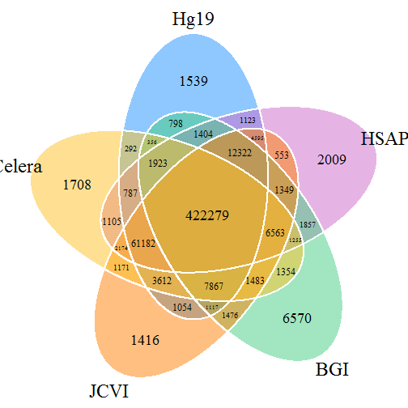 

**Figure 6. Venn diagram of overlapping perfectly matching Affymetrix(r) HGU133A Plus2 probes to each of the five human genome assemblies.**

## Conclusion

MM probes are theoretically designed to capture background and non-specific binding. Alignment of the MM probes to the
genome shows that in a very small percentage of cases, MM probes align uniquely to the genome in transcribed regions.
Signal from these probes should be useful for quantifying true transcriptional events rather than for PM signal
adjustment.

In addition, current custom CDF generation workflows ignore the MM probes during the probe alignment process. Given
that some MM probes align to reference genomes, they should be considered for inclusion when creating custom CDFs. The
utility of the probes may be limited due to variation among individuals. 

## Acknowledgements

This work was partially funded by National Institutes of Health (NIH) grant 8P20GM103436-12.  Its contents are solely
the responsibility of the authors and do not represent the official views of NIH or the National Institute of General
Medical Sciences.

## REFERENCES

[1] Schena, M., Shalon, D., Davis, R. W. and Brown, P. O. Quantitative monitoring of gene expression patterns with a complementary DNA microarray. Science, 270, 5235 (Oct 20 1995), 467-470.

[2] Nagalakshmi, U., Wang, Z., Waern, K., Shou, C., Raha, D., Gerstein, M. and Snyder, M. The transcriptional landscape of the yeast genome defined by RNA sequencing. Science, 320, 5881 (Jun 6 2008), 1344-1349.

[3] Barrett, T., Troup, D. B., Wilhite, S. E., Ledoux, P., Evangelista, C., Kim, I. F., Tomashevsky, M., Marshall, K. A., Phillippy, K. H., Sherman, P. M., Muertter, R. N., Holko, M., Ayanbule, O., Yefanov, A. and Soboleva, A. NCBI GEO: archive for functional genomics data sets--10 years on. Nucleic acids research, 39, Database issue (Jan 2011), D1005-1010.

[4] Parkinson, H., Sarkans, U., Kolesnikov, N., Abeygunawardena, N., Burdett, T., Dylag, M., Emam, I., Farne, A., Hastings, E., Holloway, E., Kurbatova, N., Lukk, M., Malone, J., Mani, R., Pilicheva, E., Rustici, G., Sharma, A., Williams, E., Adamusiak, T., Brandizi, M., Sklyar, N. and Brazma, A. ArrayExpress update--an archive of microarray and high-throughput sequencing-based functional genomics experiments. Nucleic acids research, 39, Database issue (Jan 2011), D1002-1004.

[5] Deng, Y., He, Z., Van Nostrand, J. D. and Zhou, J. Design and analysis of mismatch probes for long oligonucleotide microarrays. BMC genomics, 92008), 491.

[6] Hubbell, E., Liu, W. M. and Mei, R. Robust estimators for expression analysis. Bioinformatics, 18, 12 (Dec 2002), 1585-1592.

[7] Irizarry, R. A., Bolstad, B. M., Collin, F., Cope, L. M., Hobbs, B. and Speed, T. P. Summaries of Affymetrix GeneChip probe level data. Nucleic acids research, 31, 4 (Feb 15 2003), e15.

[8] Wu, Z. and Irizarry, R. A. Stochastic models inspired by hybridization theory for short oligonucleotide arrays. Journal of computational biology : a journal of computational molecular cell biology, 12, 6 (Jul-Aug 2005), 882-893.

[9] Carter, S. L., Eklund, A. C., Mecham, B. H., Kohane, I. S. and Szallasi, Z. Redefinition of Affymetrix probe sets by sequence overlap with cDNA microarray probes reduces cross-platform inconsistencies in cancer-associated gene expression measurements. BMC bioinformatics, 62005), 107.

[10] Dai, M., Wang, P., Boyd, A. D., Kostov, G., Athey, B., Jones, E. G., Bunney, W. E., Myers, R. M., Speed, T. P., Akil, H., Watson, S. J. and Meng, F. Evolving gene/transcript definitions significantly alter the interpretation of GeneChip data. Nucleic acids research, 33, 20 2005), e175.

[11] de Leeuw, W. C., Rauwerda, H., Jonker, M. J. and Breit, T. M. Salvaging Affymetrix probes after probe-level re-annotation. BMC research notes, 12008), 66.

[12] Ferrari, F., Bortoluzzi, S., Coppe, A., Sirota, A., Safran, M., Shmoish, M., Ferrari, S., Lancet, D., Danieli, G. A. and Bicciato, S. Novel definition files for human GeneChips based on GeneAnnot. BMC bioinformatics, 82007), 446.

[13] Langer, W., Sohler, F., Leder, G., Beckmann, G., Seidel, H., Grone, J., Hummel, M. and Sommer, A. Exon array analysis using re-defined probe sets results in reliable identification of alternatively spliced genes in non-small cell lung cancer. BMC genomics, 112010), 676.

[14] Liu, H., Zeeberg, B. R., Qu, G., Koru, A. G., Ferrucci, A., Kahn, A., Ryan, M. C., Nuhanovic, A., Munson, P. J., Reinhold, W. C., Kane, D. W. and Weinstein, J. N. AffyProbeMiner: a web resource for computing or retrieving accurately redefined Affymetrix probe sets. Bioinformatics, 23, 18 (Sep 15 2007), 2385-2390.

[15] Lu, J., Lee, J. C., Salit, M. L. and Cam, M. C. Transcript-based redefinition of grouped oligonucleotide probe sets using AceView: high-resolution annotation for microarrays. BMC bioinformatics, 82007), 108.

[16] Moll, A. G., Lindenmeyer, M. T., Kretzler, M., Nelson, P. J., Zimmer, R. and Cohen, C. D. Transcript-specific expression profiles derived from sequence-based analysis of standard microarrays. PloS one, 4, 3 2009), e4702.

[17] Moreews, F., Rauffet, G., Dehais, P. and Klopp, C. SigReannot-mart: a query environment for expression microarray probe re-annotations. Database : the journal of biological databases and curation, 20112011), bar025.

[18] Neerincx, P. B., Rauwerda, H., Nie, H., Groenen, M. A., Breit, T. M. and Leunissen, J. A. OligoRAP - an Oligo Re-Annotation Pipeline to improve annotation and estimate target specificity. BMC proceedings, 3 Suppl 42009), S4.

[19] Risueno, A., Fontanillo, C., Dinger, M. E. and De Las Rivas, J. GATExplorer: genomic and transcriptomic explorer; mapping expression probes to gene loci, transcripts, exons and ncRNAs. BMC bioinformatics, 112010), 221.

[20] Sandberg, R. and Larsson, O. Improved precision and accuracy for microarrays using updated probe set definitions. BMC bioinformatics, 82007), 48.

[21] Yin, J., McLoughlin, S., Jeffery, I. B., Glaviano, A., Kennedy, B. and Higgins, D. G. Integrating multiple genome annotation databases improves the interpretation of microarray gene expression data. BMC genomics, 112010), 50.

[22] Yu, H., Wang, F., Tu, K., Xie, L., Li, Y. Y. and Li, Y. X. Transcript-level annotation of Affymetrix probesets improves the interpretation of gene expression data. BMC bioinformatics, 82007), 194.

[23] Maglott, D., Ostell, J., Pruitt, K. D. and Tatusova, T. Entrez Gene: gene-centered information at NCBI. Nucleic acids research, 39, Database issue (Jan 2011), D52-57.

[24] Pruitt, K. D., Tatusova, T., Brown, G. R. and Maglott, D. R. NCBI Reference Sequences (RefSeq): current status, new features and genome annotation policy. Nucleic acids research, 40, Database issue (Jan 2012), D130-135.

[25] Lu, X. and Zhang, X. The effect of GeneChip gene definitions on the microarray study of cancers. BioEssays : news and reviews in molecular, cellular and developmental biology, 28, 7 (Jul 2006), 739-746.

[26] Sayers, E. W., Barrett, T., Benson, D. A., Bolton, E., Bryant, S. H., Canese, K., Chetvernin, V., Church, D. M., Dicuccio, M., Federhen, S., Feolo, M., Fingerman, I. M., Geer, L. Y., Helmberg, W., Kapustin, Y., Krasnov, S., Landsman, D., Lipman, D. J., Lu, Z., Madden, T. L., Madej, T., Maglott, D. R., Marchler-Bauer, A., Miller, V., Karsch-Mizrachi, I., Ostell, J., Panchenko, A., Phan, L., Pruitt, K. D., Schuler, G. D., Sequeira, E., Sherry, S. T., Shumway, M., Sirotkin, K., Slotta, D., Souvorov, A., Starchenko, G., Tatusova, T. A., Wagner, L., Wang, Y., Wilbur, W. J., Yaschenko, E. and Ye, J. Database resources of the National Center for Biotechnology Information. Nucleic acids research, 40, Database issue (Jan 2012), D13-25.

[27] Rouchka, E. C., Phatak, A. W. and Singh, A. V. Effect of single nucleotide polymorphisms on Affymetrix match-mismatch probe pairs. Bioinformation, 2, 9 2008), 405-411.

[28] Dreszer, T. R., Karolchik, D., Zweig, A. S., Hinrichs, A. S., Raney, B. J., Kuhn, R. M., Meyer, L. R., Wong, M., Sloan, C. A., Rosenbloom, K. R., Roe, G., Rhead, B., Pohl, A., Malladi, V. S., Li, C. H., Learned, K., Kirkup, V., Hsu, F., Harte, R. A., Guruvadoo, L., Goldman, M., Giardine, B. M., Fujita, P. A., Diekhans, M., Cline, M. S., Clawson, H., Barber, G. P., Haussler, D. and James Kent, W. The UCSC Genome Browser database: extensions and updates 2011. Nucleic acids research, 40, Database issue (Jan 2012), D918-923.

[29] Langmead, B., Trapnell, C., Pop, M. and Salzberg, S. L. Ultrafast and memory-efficient alignment of short DNA sequences to the human genome. Genome biology, 10, 3 2009), R25.

[30] Liu, G., Loraine, A. E., Shigeta, R., Cline, M., Cheng, J., Valmeekam, V., Sun, S., Kulp, D. and Siani-Rose, M. A. NetAffx: Affymetrix probesets and annotations. Nucleic acids research, 31, 1 (Jan 1 2003), 82-86.

[31] Aboyoun, H., Pages, H. and Lawrence, M. GenomicRanges: Representation and manipulation of genomic intervals. . City.

[32] Gnerre, S., Maccallum, I., Przybylski, D., Ribeiro, F. J., Burton, J. N., Walker, B. J., Sharpe, T., Hall, G., Shea, T. P., Sykes, S., Berlin, A. M., Aird, D., Costello, M., Daza, R., Williams, L., Nicol, R., Gnirke, A., Nusbaum, C., Lander, E. S. and Jaffe, D. B. High-quality draft assemblies of mammalian genomes from massively parallel sequence data. Proceedings of the National Academy of Sciences of the United States of America, 108, 4 (Jan 25 2011), 1513-1518.

[33] Istrail, S., Sutton, G. G., Florea, L., Halpern, A. L., Mobarry, C. M., Lippert, R., Walenz, B., Shatkay, H., Dew, I., Miller, J. R., Flanigan, M. J., Edwards, N. J., Bolanos, R., Fasulo, D., Halldorsson, B. V., Hannenhalli, S., Turner, R., Yooseph, S., Lu, F., Nusskern, D. R., Shue, B. C., Zheng, X. H., Zhong, F., Delcher, A. L., Huson, D. H., Kravitz, S. A., Mouchard, L., Reinert, K., Remington, K. A., Clark, A. G., Waterman, M. S., Eichler, E. E., Adams, M. D., Hunkapiller, M. W., Myers, E. W. and Venter, J. C. Whole-genome shotgun assembly and comparison of human genome assemblies. Proceedings of the National Academy of Sciences of the United States of America, 101, 7 (Feb 17 2004), 1916-1921.

[34] Lander, E. S., Linton, L. M., Birren, B., Nusbaum, C., Zody, M. C., Baldwin, J., Devon, K., Dewar, K., Doyle, M., FitzHugh, W., Funke, R., Gage, D., Harris, K., Heaford, A., Howland, J., Kann, L., Lehoczky, J., LeVine, R., McEwan, P., McKernan, K., Meldrim, J., Mesirov, J. P., Miranda, C., Morris, W., Naylor, J., Raymond, C., Rosetti, M., Santos, R., Sheridan, A., Sougnez, C., Stange-Thomann, N., Stojanovic, N., Subramanian, A., Wyman, D., Rogers, J., Sulston, J., Ainscough, R., Beck, S., Bentley, D., Burton, J., Clee, C., Carter, N., Coulson, A., Deadman, R., Deloukas, P., Dunham, A., Dunham, I., Durbin, R., French, L., Grafham, D., Gregory, S., Hubbard, T., Humphray, S., Hunt, A., Jones, M., Lloyd, C., McMurray, A., Matthews, L., Mercer, S., Milne, S., Mullikin, J. C., Mungall, A., Plumb, R., Ross, M., Shownkeen, R., Sims, S., Waterston, R. H., Wilson, R. K., Hillier, L. W., McPherson, J. D., Marra, M. A., Mardis, E. R., Fulton, L. A., Chinwalla, A. T., Pepin, K. H., Gish, W. R., Chissoe, S. L., Wendl, M. C., Delehaunty, K. D., Miner, T. L., Delehaunty, A., Kramer, J. B., Cook, L. L., Fulton, R. S., Johnson, D. L., Minx, P. J., Clifton, S. W., Hawkins, T., Branscomb, E., Predki, P., Richardson, P., Wenning, S., Slezak, T., Doggett, N., Cheng, J. F., Olsen, A., Lucas, S., Elkin, C., Uberbacher, E., Frazier, M., Gibbs, R. A., Muzny, D. M., Scherer, S. E., Bouck, J. B., Sodergren, E. J., Worley, K. C., Rives, C. M., Gorrell, J. H., Metzker, M. L., Naylor, S. L., Kucherlapati, R. S., Nelson, D. L., Weinstock, G. M., Sakaki, Y., Fujiyama, A., Hattori, M., Yada, T., Toyoda, A., Itoh, T., Kawagoe, C., Watanabe, H., Totoki, Y., Taylor, T., Weissenbach, J., Heilig, R., Saurin, W., Artiguenave, F., Brottier, P., Bruls, T., Pelletier, E., Robert, C., Wincker, P., Smith, D. R., Doucette-Stamm, L., Rubenfield, M., Weinstock, K., Lee, H. M., Dubois, J., Rosenthal, A., Platzer, M., Nyakatura, G., Taudien, S., Rump, A., Yang, H., Yu, J., Wang, J., Huang, G., Gu, J., Hood, L., Rowen, L., Madan, A., Qin, S., Davis, R. W., Federspiel, N. A., Abola, A. P., Proctor, M. J., Myers, R. M., Schmutz, J., Dickson, M., Grimwood, J., Cox, D. R., Olson, M. V., Kaul, R., Shimizu, N., Kawasaki, K., Minoshima, S., Evans, G. A., Athanasiou, M., Schultz, R., Roe, B. A., Chen, F., Pan, H., Ramser, J., Lehrach, H., Reinhardt, R., McCombie, W. R., de la Bastide, M., Dedhia, N., Blocker, H., Hornischer, K., Nordsiek, G., Agarwala, R., Aravind, L., Bailey, J. A., Bateman, A., Batzoglou, S., Birney, E., Bork, P., Brown, D. G., Burge, C. B., Cerutti, L., Chen, H. C., Church, D., Clamp, M., Copley, R. R., Doerks, T., Eddy, S. R., Eichler, E. E., Furey, T. S., Galagan, J., Gilbert, J. G., Harmon, C., Hayashizaki, Y., Haussler, D., Hermjakob, H., Hokamp, K., Jang, W., Johnson, L. S., Jones, T. A., Kasif, S., Kaspryzk, A., Kennedy, S., Kent, W. J., Kitts, P., Koonin, E. V., Korf, I., Kulp, D., Lancet, D., Lowe, T. M., McLysaght, A., Mikkelsen, T., Moran, J. V., Mulder, N., Pollara, V. J., Ponting, C. P., Schuler, G., Schultz, J., Slater, G., Smit, A. F., Stupka, E., Szustakowski, J., Thierry-Mieg, D., Thierry-Mieg, J., Wagner, L., Wallis, J., Wheeler, R., Williams, A., Wolf, Y. I., Wolfe, K. H., Yang, S. P., Yeh, R. F., Collins, F., Guyer, M. S., Peterson, J., Felsenfeld, A., Wetterstrand, K. A., Patrinos, A., Morgan, M. J., de Jong, P., Catanese, J. J., Osoegawa, K., Shizuya, H., Choi, S. and Chen, Y. J. Initial sequencing and analysis of the human genome. Nature, 409, 6822 (Feb 15 2001), 860-921.

[35] Levy, S., Sutton, G., Ng, P. C., Feuk, L., Halpern, A. L., Walenz, B. P., Axelrod, N., Huang, J., Kirkness, E. F., Denisov, G., Lin, Y., MacDonald, J. R., Pang, A. W., Shago, M., Stockwell, T. B., Tsiamouri, A., Bafna, V., Bansal, V., Kravitz, S. A., Busam, D. A., Beeson, K. Y., McIntosh, T. C., Remington, K. A., Abril, J. F., Gill, J., Borman, J., Rogers, Y. H., Frazier, M. E., Scherer, S. W., Strausberg, R. L. and Venter, J. C. The diploid genome sequence of an individual human. PLoS biology, 5, 10 (Sep 4 2007), e254.

[36] Li, R., Li, Y., Zheng, H., Luo, R., Zhu, H., Li, Q., Qian, W., Ren, Y., Tian, G., Li, J., Zhou, G., Zhu, X., Wu, H., Qin, J., Jin, X., Li, D., Cao, H., Hu, X., Blanche, H., Cann, H., Zhang, X., Li, S., Bolund, L., Kristiansen, K., Yang, H. and Wang, J. Building the sequence map of the human pan-genome. Nature biotechnology, 28, 1 (Jan 2010), 57-63.
