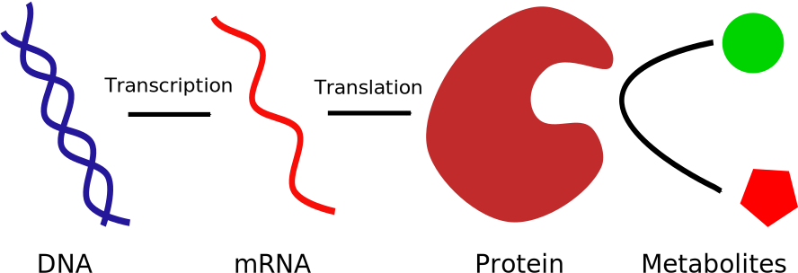
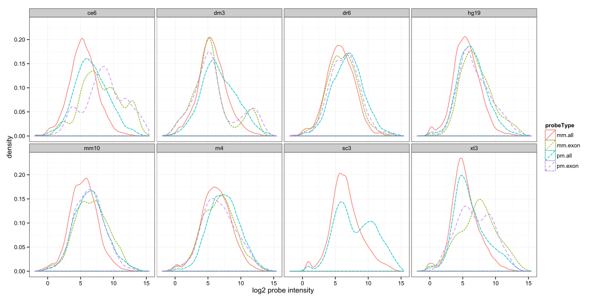

% Affymetrix MisMatch (MM) Probes:   Useful After All
% Robert M Flight; Abdallah Eteleeb; Eric C Rouchka
% 14/12/12

## Transcriptomics

## Transcriptomics

# Affymetrix GeneChips

## GeneChip

- Measures abundance of RNA **transcripts**
- 25 mer oligonucleotides on solid support
- Oligonucleotides organized into **probesets**
- **Probeset** consists of 11, 16, 20, 25 probe pairs
- Each probe pair consists of a perfect match (PM) and mis-match (MM) probe

## GeneChip & ProbeSet

 

 

## Perfect Match & MisMatch

- Perfect Match (PM)
    - Supposed to perfectly match the sequence of interest
    - Has exact complementarity
    - Binds **perfectly**
- MisMatch (MM)
    - 13th base is reverse complement of **PM** sequence
    - Supposed to account for non-specific binding in the **PM**
    - Therefore should have lower signal
    - Useful for **PM** signal correction

## 

<pre><code>
pm CACCCAGCTGGTCCTGTGGATGGGA mm CACCCAGCTGGTGCTGTGGATGGGA

</pre></code>

## Perfect Match & MisMatch

- True Signal
    - Should be PM - MM
- But ...
    - MM may have higher signal than PM
    - Most modern summarization methods ignore it

## ProbeSets

- Collection of probes that align to a sequence defined for
    - Transcripts
    - Genes
    - Gene families

### Defined by Affymetrix based on available annotations

## Custom ProbeSets

- Reorganize probes based on the available
    - Probe sequences & chip locations
    - Target genome sequences (reference genome)
    - Genome annotations (genes, transcripts, exons, etc)
- Generate probe sets
    - Perfectly aligned to reference genome
    - All probes bind the same genomic element (exon, transcript, gene)
    - Binding region does not encompass a lot of SNPs

## Better Results

- Reorganization gives results that are:
    - more reproducible
    - more consistent
    
- Dai et al, 2005, NAR 33(20):e175 
- Sandberg & Larsson, 2007, BMC Bioinf. 8:48
- 41 `BrainArray` platforms on GEO
    - http://brainarray.mbni.med.umich.edu/Brainarray/Database/CustomCDF/genomic_curated_CDF.asp

## But...

- Only uses perfect match (PM) probes!
- What about mismatch probes (MM)?
- Why not?
    - Have sequences
    - Align to genome

## MM Probe Alignment

- Compare 
    - Alignment of PM and MM probes to genome
    - Signal of PM and MM probes

## Organisms

<!-- html table generated in R 2.15.1 by xtable 1.7-0 package -->
<!-- Wed Dec 12 08:38:41 2012 -->
<TABLE style="border-spacing:20px 5px;">
<TR> <TH> Organism </TH> <TH> Reference Assembly </TH> <TH> Build Date </TH>  </TR>
  <TR> <TD> *C elegans* </TD> <TD> ce6 </TD> <TD> May 2008 </TD> </TR>
  <TR> <TD> *D melanogaster* </TD> <TD> dm3 </TD> <TD> Apr. 2006 </TD> </TR>
  <TR> <TD> *S cerevisiae* </TD> <TD> sc3 </TD> <TD> Apr. 2011 </TD> </TR>
  <TR> <TD> *X tropicalis* </TD> <TD> xt3 </TD> <TD> Nov 2009 </TD> </TR>
  <TR> <TD> *D rerio* </TD> <TD> dr6 </TD> <TD> Dec. 2008 </TD> </TR>
  <TR> <TD> *M musculus* </TD> <TD> mm10 </TD> <TD> Dec. 2011 </TD> </TR>
  <TR> <TD> *R norvegicus* </TD> <TD> rn4 </TD> <TD> Nov 2004 </TD> </TR>
  <TR> <TD> *H sapiens* </TD> <TD> hg19 </TD> <TD> Feb. 2009 </TD> </TR>
   </TABLE>

## GeneChips

<!-- html table generated in R 2.15.1 by xtable 1.7-0 package -->
<!-- Wed Dec 12 08:38:41 2012 -->
<TABLE style="border-spacing:20px 5px;">
<TR> <TH> Organism </TH> <TH> GeneChip </TH>  </TR>
  <TR> <TD> *C elegans* </TD> <TD> C. elegans Genome </TD> </TR>
  <TR> <TD> *D melanogaster* </TD> <TD> Drosophila Genome 2.0 </TD> </TR>
  <TR> <TD> *S cerevisiae* </TD> <TD> Yeast Genome 2.0 </TD> </TR>
  <TR> <TD> *X tropicalis* </TD> <TD> X. tropicalus Genome </TD> </TR>
  <TR> <TD> *D rerio* </TD> <TD> Zebrafish Genome </TD> </TR>
  <TR> <TD> *M musculus* </TD> <TD> Mouse Genome 430 2.0 </TD> </TR>
  <TR> <TD> *R norvegicus* </TD> <TD> Rat Genome 230 2.0 </TD> </TR>
  <TR> <TD> *H sapiens* </TD> <TD> Human Genome U133 Plus 2.0 </TD> </TR>
   </TABLE>

## Microarray Data

- Random data from gene expression omnibus (GEO)
- 20 random CEL files for each organism
    - Only 4 for *X. tropicalis*, 12 for Yeast
    
## Probe Sequences & Alignment

- Sequences:
    - **Bioconductor** `probe` packages
    - MM sequences generated from PM sequences
- Alignments:
    - PM and MM sequence aligned to reference using `bowtie v0.12.8`
    - **All** alignments with **0** mismatches
    
# Results

## Number of Alignments

<!-- html table generated in R 2.15.1 by xtable 1.7-0 package -->
<!-- Wed Dec 12 08:38:41 2012 -->
<TABLE style="font-size:70%; text-align:left; border-spacing:20px 5px;">
<TR> <TH> Organism </TH> <TH> Number of Probe Pairs </TH> <TH> PM Mapped to Reference </TH> <TH> MM Mapped to Reference </TH> <TH> PM Unique </TH> <TH> MM Unique </TH>  </TR>
  <TR> <TD> *Ce* </TD> <TD align="right"> 249165 </TD> <TD align="right"> 226856 </TD> <TD align="right"> 143 </TD> <TD align="right"> 213745 </TD> <TD align="right">  96 </TD> </TR>
  <TR> <TD> *Dm* </TD> <TD align="right"> 265400 </TD> <TD align="right"> 251602 </TD> <TD align="right">  89 </TD> <TD align="right"> 245712 </TD> <TD align="right">  54 </TD> </TR>
  <TR> <TD> *Dr* </TD> <TD align="right"> 249752 </TD> <TD align="right"> 200608 </TD> <TD align="right"> 1282 </TD> <TD align="right"> 171282 </TD> <TD align="right"> 726 </TD> </TR>
  <TR> <TD> *Hs* </TD> <TD align="right"> 604258 </TD> <TD align="right"> 562673 </TD> <TD align="right"> 1094 </TD> <TD align="right"> 521642 </TD> <TD align="right"> 608 </TD> </TR>
  <TR> <TD> *Mm* </TD> <TD align="right"> 496468 </TD> <TD align="right"> 456674 </TD> <TD align="right"> 557 </TD> <TD align="right"> 427920 </TD> <TD align="right"> 394 </TD> </TR>
  <TR> <TD> *Rn* </TD> <TD align="right"> 342410 </TD> <TD align="right"> 304646 </TD> <TD align="right"> 391 </TD> <TD align="right"> 286784 </TD> <TD align="right"> 282 </TD> </TR>
  <TR> <TD> *Sc* </TD> <TD align="right"> 120855 </TD> <TD align="right"> 63731 </TD> <TD align="right">   1 </TD> <TD align="right"> 61942 </TD> <TD align="right">   1 </TD> </TR>
  <TR> <TD> *Xt* </TD> <TD align="right"> 648548 </TD> <TD align="right"> 519177 </TD> <TD align="right"> 1884 </TD> <TD align="right"> 426237 </TD> <TD align="right"> 1014 </TD> </TR>
   </TABLE>

## Comparison of PM and MM Signals

Signal density for all probes and those that align to known exons.

 

## Comparison of PM and MM Signals

- MM generally show lower signal than PM
- MM in exons **trend** toward the signal of PM in exons
- These would confound any analysis depending on PM - MM

## PM MM Negative Difference

 

 

## TM Signal 

- Compare signal of exon matching MM with other probes in that exon
- Matches much better than with the other MM probes
- Call these "true match" probes, because they are based on alignment
- Is this a general phenomenom?

 

## MM vs TM Correlation

- Compare correlations of candidate TM with MMs or TMs on same exon

 

## Different Transcripts?

<!-- html table generated in R 2.15.1 by xtable 1.7-0 package -->
<!-- Wed Dec 12 08:39:15 2012 -->
<TABLE style="font-size:50%; text-align:left; border-spacing:20px 5px;">
<TR> <TH> tm </TH> <TH> mm </TH> <TH> Annotated RefSeq </TH> <TH> Exon RefSeq </TH> <TH> Annotated Symbol </TH> <TH> Exon Symbol </TH>  </TR>
  <TR> <TD align="right"> 0.87 </TD> <TD align="right"> 0.53 </TD> <TD> NM_001164750, NM_001164751, NM_001164752, NM_001164753, NM_001164754, NM_001164755, NM_001164756, NM_004318, NM_020164, NM_032466, NM_032467, NM_032468 </TD> <TD> NM_032466, NM_032468, NM_001164755, NM_001164754, NM_001164753, NM_001164752, NM_001164751 </TD> <TD> ASPH </TD> <TD> ASPH </TD> </TR>
  <TR> <TD align="right"> 0.86 </TD> <TD align="right"> 0.61 </TD> <TD> NM_000898 </TD> <TD> NM_000898 </TD> <TD> MAOB </TD> <TD> MAOB </TD> </TR>
  <TR> <TD align="right"> 0.84 </TD> <TD align="right"> 0.60 </TD> <TD> NM_005328 </TD> <TD> NM_005328 </TD> <TD> HAS2 </TD> <TD> HAS2 </TD> </TR>
  <TR> <TD align="right"> 0.81 </TD> <TD align="right"> 0.55 </TD> <TD> NM_001173487, NM_001173488, NM_017544 </TD> <TD> NM_001173488, NM_001173487, NM_017544 </TD> <TD> NKRF </TD> <TD> NKRF </TD> </TR>
  <TR> <TD align="right"> 0.81 </TD> <TD align="right"> 0.78 </TD> <TD> NM_014390 </TD> <TD> NM_014390 </TD> <TD> SND1 </TD> <TD> SND1 </TD> </TR>
  <TR> <TD align="right"> 0.79 </TD> <TD align="right"> 0.82 </TD> <TD> NM_213600, NR_033151 </TD> <TD> NM_213600, NR_033151 </TD> <TD> PLA2G4F </TD> <TD> PLA2G4F </TD> </TR>
   </TABLE>

- Is the MM annotated transcript different than the mapped TM transcript (hg19)?
    - MM and TM map to the same transcript!
    - MM actually perfectly matches its transcript!
    
    

## ProbeSet Classes

Which types of PM probes align to multiple locations?

## ProbeSet Classes

<!-- html table generated in R 2.15.1 by xtable 1.7-0 package -->
<!-- Wed Dec 12 08:39:18 2012 -->
<TABLE style="font-size:70%; text-align:left; border-spacing:20px 5px;">
<TR> <TH> Organism </TH> <TH> _at </TH> <TH> _a_at </TH> <TH> _s_at </TH> <TH> _x_at </TH>  </TR>
  <TR> <TD> *Ce* </TD> <TD> 2465 (19%) </TD> <TD> 0 (0%) </TD> <TD> 6416 (49%) </TD> <TD> 4040 (31%) </TD> </TR>
  <TR> <TD> *Dm* </TD> <TD> 2520 (43%) </TD> <TD> 224 (3.8%) </TD> <TD> 2742 (47%) </TD> <TD> 361 (6.1%) </TD> </TR>
  <TR> <TD> *Dr* </TD> <TD> 25879 (88%) </TD> <TD> 1203 (4.1%) </TD> <TD> 374 (1.3%) </TD> <TD> 1376 (4.7%) </TD> </TR>
  <TR> <TD> *Hs* </TD> <TD> 19961 (49%) </TD> <TD> 803 (2%) </TD> <TD> 10634 (26%) </TD> <TD> 9402 (23%) </TD> </TR>
  <TR> <TD> *Mm* </TD> <TD> 16703 (58%) </TD> <TD> 4893 (17%) </TD> <TD> 2920 (10%) </TD> <TD> 4075 (14%) </TD> </TR>
  <TR> <TD> *Rn* </TD> <TD> 16127 (90%) </TD> <TD> 805 (4.5%) </TD> <TD> 394 (2.2%) </TD> <TD> 440 (2.5%) </TD> </TR>
  <TR> <TD> *Sc* </TD> <TD> 271 (15%) </TD> <TD> 0 (0%) </TD> <TD> 1126 (63%) </TD> <TD> 81 (4.5%) </TD> </TR>
  <TR> <TD> *Xt* </TD> <TD> 31754 (34%) </TD> <TD> 34877 (38%) </TD> <TD> 12086 (13%) </TD> <TD> 14092 (15%) </TD> </TR>
   </TABLE>

## Variation

- Align PM to five human genome assemblies

<!-- html table generated in R 2.15.1 by xtable 1.7-0 package -->
<!-- Wed Dec 12 08:39:18 2012 -->
<TABLE style="font-size:90%; text-align:left; border-spacing:20px 5px;">
<TR> <TH> Name </TH> <TH> Abbr </TH> <TH> Assembly </TH> <TH> Bioproject </TH> <TH> Race </TH>  </TR>
  <TR> <TD> GRCh37 </TD> <TD> Hg19 </TD> <TD> 420368 </TD> <TD> 31257 </TD> <TD> Mixed </TD> </TR>
  <TR> <TD> HS_Celera_WGSA </TD> <TD> Celera </TD> <TD> 281338 </TD> <TD> 1431 </TD> <TD> Mixed </TD> </TR>
  <TR> <TD> HuRefPrime </TD> <TD> JCVI </TD> <TD> 281188 </TD> <TD> 19621 </TD> <TD> Caucasian </TD> </TR>
  <TR> <TD> BIGAF </TD> <TD> BGI </TD> <TD> 165398 </TD> <TD> 42201 </TD> <TD> African </TD> </TR>
  <TR> <TD> HsapALLPATHS1 </TD> <TD> HSAP1 </TD> <TD> 238948 </TD> <TD> 59877 </TD> <TD> Caucasian </TD> </TR>
   </TABLE>

## Mapping Differences

<!-- html table generated in R 2.15.1 by xtable 1.7-0 package -->
<!-- Wed Dec 12 08:39:48 2012 -->
<TABLE style="border-spacing:20px 5px;">
<TR> <TH> Assembly </TH> <TH> Total </TH> <TH> Perfect Match </TH> <TH> Mismatch </TH>  </TR>
  <TR> <TD> Hg19 </TD> <TD align="right"> 522250 </TD> <TD align="right"> 521642 </TD> <TD align="right"> 608 </TD> </TR>
  <TR> <TD> Celera </TD> <TD align="right"> 515111 </TD> <TD align="right"> 514518 </TD> <TD align="right"> 593 </TD> </TR>
  <TR> <TD> JCVI </TD> <TD align="right"> 530213 </TD> <TD align="right"> 529569 </TD> <TD align="right"> 644 </TD> </TR>
  <TR> <TD> BGI </TD> <TD align="right"> 469973 </TD> <TD align="right"> 469714 </TD> <TD align="right"> 259 </TD> </TR>
  <TR> <TD> HSAP1 </TD> <TD align="right"> 522480 </TD> <TD align="right"> 521922 </TD> <TD align="right"> 558 </TD> </TR>
   </TABLE>

## Mapping Differences

 

- 161 shared MM probes
- 24 fall within RefSeq annotated exonic regions
- 16 show higher correlation with TM than MM

## Summary

- MM probes 
    - Small percentage appear able to capture **true** transcriptional events
    - Therefore, custom probeset workflows should include the MM probe sequences
- PM probes don't necessarily align as expected
- Probe alignment varies depending on genome build

## Acknowledgements

- National Institutes of Health (NIH) grant 8P20GM103436-12
- University of Louisville Bioinformatics Lab
    - bioinformatics.louisville.edu

## Questions??

## Tools Used

- Produced using:
    - `knitr`
    - `pandoc`
    - `dzslides`
    
- Source code on Github
    - github.com/rmflight/affyMM

- Draft report on Github
    - rmflight.github.com/affyMM
    - rmflight.github.com/affyMM/presentation.html
    
    

    
## Session Info

R version 2.15.1 (2012-06-22)
Platform: x86_64-pc-mingw32/x64 (64-bit)

locale:
[1] LC_COLLATE=English_United States.1252 
[2] LC_CTYPE=English_United States.1252   
[3] LC_MONETARY=English_United States.1252
[4] LC_NUMERIC=C                          
[5] LC_TIME=English_United States.1252    

attached base packages:
[1] grid      stats     graphics  grDevices utils     datasets  methods  
[8] base     

other attached packages:
 [1] GenomicRanges_1.8.13    xtable_1.7-0           
 [3] Biostrings_2.24.1       IRanges_1.14.4         
 [5] affy_1.34.0             hgu133plus2probe_2.10.0
 [7] hgu133plus2cdf_2.10.0   hgu133plus2.db_2.7.1   
 [9] org.Hs.eg.db_2.7.1      RSQLite_0.11.2         
[11] DBI_0.2-5               AnnotationDbi_1.18.3   
[13] Biobase_2.16.0          BiocGenerics_0.2.0     
[15] VennDiagram_1.5.1       plyr_1.7.1             
[17] ggplot2_0.9.2.1         knitr_0.8              

loaded via a namespace (and not attached):
 [1] affyio_1.24.0         BiocInstaller_1.4.9   colorspace_1.1-1     
 [4] dichromat_1.2-4       digest_0.5.2          evaluate_0.4.2       
 [7] formatR_0.6           gtable_0.1.1          labeling_0.1         
[10] MASS_7.3-18           memoise_0.1           munsell_0.4          
[13] preprocessCore_1.18.0 proto_0.3-9.2         RColorBrewer_1.0-5   
[16] reshape2_1.2.1        scales_0.2.2          stats4_2.15.1        
[19] stringr_0.6.1         tools_2.15.1          zlibbioc_1.2.0       

## 

require(knitr)
knit("rmflight_biomedCom_2012.Rmd")
system("pandoc --self-contained -s -S -t dzslides --slide-level=2 --mathjax rmflight_biomedCom_2012.md -o rmflight_biomedCom_2012.html")
